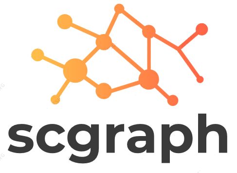

`scgraph` is a collection of graph-based algorithms for the analysis of high-dimensional, high-throughput data, with a particular focus on single-cell genomics. `scgraph` currently contains methods for running:

* [MAGIC](https://github.com/KrishnaswamyLab/MAGIC)
* [PHATE](https://github.com/KrishnaswamyLab/PHATE)
* [MELD](https://github.com/KrishnaswamyLab/MELD)

## Installation

You can install `scgraph` with `pip`:

```
pip install --user git+https://github.com/KrishnaswamyLab/scgraph
```

## Usage

You can use `scgraph` as follows:

```
import scprep
import scgraph

data = scprep.io.load_csv("my_data.csv")
data_graph = scgraph.Graph(data)

data_phate = scgraph.PHATE().fit_transform(data_graph)
data_magic = scgraph.MAGIC().fit_transform(data, graph=data_graph)

signal = scprep.io.load_csv("metadata.csv")
data_meld = scgraph.MELD().fit_transform(RES=signal, G=data_graph)
```